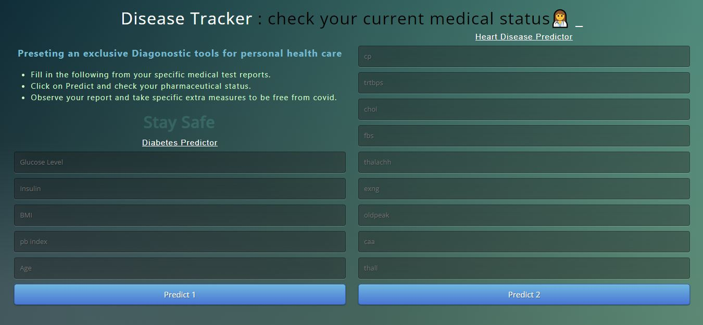
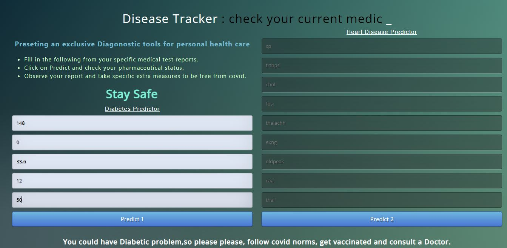

# *Disease (Diabetes & Heart) Finder*
************
This is machine learning model made to predict diseases in a person using basic informations of medical tests. 
Using a desktop app the user inputs are taken and various algorithms are implemented on it. Later it is predicted wheteher the person has that particular disease or nor and output is shown on the website. 

************
## 
How to use the app ??

Step 1 : Clone the repository

Step 2 : Make an environment in terminal Jupyter Notebook [using: python -m venv C:\Users\Admin\Desktop\HealthyorNot]

Step 3 : Run app.py on terminal to make a local server.

Step 4 : Click on the website link made through server [ex : * Running on http://127.0.0.1:5000/ (Press CTRL+C to quit)]

----------------------------------------------------------------------------------------------------------------------------------------------------------------------------------
### **Screenshots** 

************

Fill in the form to get a prediction of wheteher you have the diasease or not.

************

************

 

